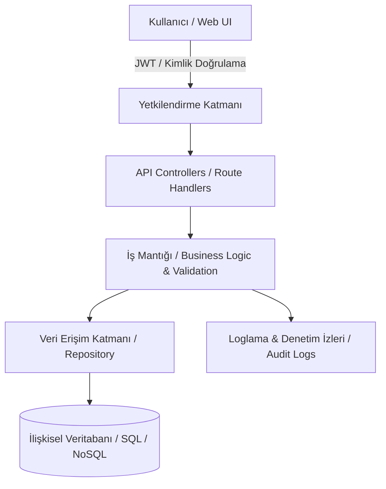

<div align="center">

# 📝 PersonelNotes

### *Modern, Güvenli ve Modüler Personel / Çalışan Not & Görev Yönetim Sistemi*

[](https://github.com/UmutGuvenUslu/PersonelNotes/stargazers)
[](https://github.com/UmutGuvenUslu/PersonelNotes/network/members)
[](https://github.com/UmutGuvenUslu/PersonelNotes/issues)
[](LICENSE)
[](https://github.com/UmutGuvenUslu/PersonelNotes)

<p align="center">
  <a href="#-proje-hakkında">Proje Hakkında</a> •
  <a href="#-özellikler">Özellikler</a> •
  <a href="#-mimari-ve-veri-akışı">Mimari</a> •
  <a href="#-kullanılan-teknolojiler">Teknolojiler</a> •
  <a href="#-kurulum-ve-çalıştırma">Kurulum</a> •
  <a href="#-api--kullanım-rehberi">Kullanım</a> •
  <a href="#-proje-dizin-yapısı">Dizin Yapısı</a> •
  <a href="#-katkıda-bulunma">Katkı</a>
</p>

</div>

---

## 📌 Proje Hakkında

**PersonelNotes**, kurumsal ekipler ve bireysel yöneticiler için personel bazlı not tutma, performans/görev takibi ve kayıt yönetimini dijitalleştiren tam kapsamlı bir yönetim uygulamasıdır. 

Departman veya personel bazında kategorize edilmiş notlar, yetkilendirme katmanları, etiketleme ve gelişmiş filtreleme mekanizmalarıyla operasyonel verimliliği artırmak için tasarlanmıştır.

---

## ✨ Özellikler

- 👥 **Personel & Departman Hiyerarşisi:** Personelleri departman, pozisyon ve yetki bazında filtreleyerek not atama.
- 🏷️ **Kategori & Etiketleme (Tags):** Notları öncelik düzeyine (*Acil, Normal, Düşük*), tipe (*Toplantı, Geri Bildirim, Performans*) göre etiketleme.
- 🔒 **Güvenlik & Rol Bazlı Erişim (RBAC):** Yönetici ve çalışan rollerine özel yetkilendirme ve veri gizliliği.
- 🔍 **Gelişmiş Arama & Filtreleme:** Tarih, personel, departman veya anahtar kelimeye göre anlık arama desteği.
- 📊 **Aktivite Loglama:** Personel kayıtları üzerinde yapılan değişikliklerin (oluşturma, güncelleme, silme) zaman damgalı takibi.
- 📱 **Modern & Duyarlı (Responsive) Arayüz:** Masaüstü ve mobil ekranlarla tam uyumlu kullanıcı deneyimi.

---

## 🧠 Mimari ve Veri Akışı



---

## 🛠️ Kullanılan Teknolojiler

| Katman | Teknoloji / Kütüphane | Açıklama |
| :--- | :--- | :--- |
| **Backend / API** | .NET / Node.js / Python | Güvenli RESTful API mimarisi ve iş mantığı |
| **Frontend** | React / Modern UI | Hızlı, dinamik ve bileşen tabanlı kullanıcı arayüzü |
| **Veritabanı** | PostgreSQL / MS SQL / SQLite | İlişkisel veri ve personel-not şemaları |
| **Kimlik Doğrulama** | JWT (JSON Web Tokens) | Güvenli oturum ve rol bazlı erişim denetimi |
| **Stil / Arayüz** | Tailwind CSS / Bootstrap | Modern, sade ve kullanıcı dostu tasarım bileşenleri |

---

## 🚀 Kurulum ve Çalıştırma

Projeyi yerel geliştirme ortamınızda ayağa kaldırmak için aşağıdaki adımları takip edebilirsiniz:

### 1. Repoyu Klonlayın
```bash
git clone [https://github.com/UmutGuvenUslu/PersonelNotes.git](https://github.com/UmutGuvenUslu/PersonelNotes.git)
cd PersonelNotes
```

### 2. Çevre Değişkenlerini (Environment Variables) Ayarlayın
Kök dizinde veya servis klasöründe `.env.example` dosyasını `.env` olarak kopyalayın:
```bash
cp .env.example .env
```
`.env` içeriğini yerel veritabanı ve gizli anahtarlarınıza göre güncelleyin:
```env
PORT=5000
DATABASE_URL=Server=localhost;Database=PersonelNotesDb;Trusted_Connection=True;
JWT_SECRET=super_secret_jwt_key_here
NODE_ENV=development
```

### 3. Bağımlılıkları Yükleyin ve Veritabanını Hazırlayın
```bash
# Bağımlılıkları yükleyin
npm install   # veya dotnet restore / pip install -r requirements.txt

# Veritabanı migration işlemlerini uygulayın
npm run db:migrate   # veya dotnet ef database update
```

### 4. Uygulamayı Başlatın
```bash
# Geliştirme (Development) modunda çalıştırma
npm run dev   # veya dotnet run
```

Uygulama varsayılan olarak `http://localhost:5000` (veya `http://localhost:3000`) adresinde çalışmaya başlayacaktır.

---

## 💻 API & Kullanım Rehberi

### Örnek RESTful Uç Noktaları (Endpoints)

| Metot | Uç Nokta (Endpoint) | Açıklama |
| :--- | :--- | :--- |
| `POST` | `/api/auth/login` | Kullanıcı girişi ve JWT token alma |
| `GET` | `/api/employees` | Personel listesini getirme |
| `POST` | `/api/employees` | Yeni personel kaydı ekleme |
| `GET` | `/api/notes?employeeId=1` | Belirli bir personele ait notları listeleme |
| `POST` | `/api/notes` | Personele yeni not/görev ekleme |
| `DELETE` | `/api/notes/:id` | Not kaydını silme |

#### Örnek JSON Not Ekleme Gövdesi (`POST /api/notes`):
```json
{
  "employeeId": 12,
  "title": "Aylık Performans Değerlendirmesi",
  "content": "Sprint hedeflerini başarıyla tamamladı. Geliştirmeleri teslim etti.",
  "priority": "High",
  "category": "Performance",
  "dueDate": "2026-09-01T10:00:00Z"
}
```

---

## 📂 Proje Dizin Yapısı

```plaintext
PersonelNotes/
├── src/ / Controllers/       # İstek karşılayıcılar ve API yönlendirmeleri
├── models/ / Entities/       # Personel, Not, Rol ve Departman veri modelleri
├── services/ / Business/     # İş kuralları ve iş mantığı servisleri
├── data/ / Repositories/     # Veritabanı bağlamı ve sorgu operasyonları
├── middleware/               # Kimlik doğrulama, hata yakalama ve loglama filtreleri
├── client/ / Views/          # Kullanıcı arayüzü ve bileşenleri (Frontend)
├── tests/                    # Birim (Unit) ve Entegrasyon testleri
├── .env.example
├── .gitignore
├── LICENSE
├── package.json / *.sln
└── README.md
```

---

## 🗺️ Yol Haritası (Roadmap)

- [x] Personel ve temel CRUD not yönetimi
- [x] Rol bazlı kullanıcı kimlik doğrulama (JWT)
- [ ] Personel notları için PDF / Excel dışa aktarma (Export) desteği
- [ ] Hatırlatıcı e-posta bildirimleri (Notification Service)
- [ ] Çoklu dil (i18n) desteği

---

## 🤝 Katkıda Bulunma

Katkılarınız projeyi daha iyi hale getirecektir:

1. Projeyi Fork'layın (`Fork`)
2. Özellik dalınızı oluşturun (`git checkout -b feature/HarikaOzellik`)
3. Değişikliklerinizi commit edin (`git commit -m 'feat: Yeni özellik eklendi'`)
4. Dalınıza push yapın (`git push origin feature/HarikaOzellik`)
5. Bir **Pull Request** açın

---

## 📄 Lisans

Bu proje [MIT Lisansı](LICENSE) kapsamında lisanslanmıştır.

---

<div align="center">

Geliştirici: **[Umut Güven Uslu](https://github.com/UmutGuvenUslu)**

⭐ Projeyi beğendiyseniz yıldız vermeyi unutmayın!

</div>
